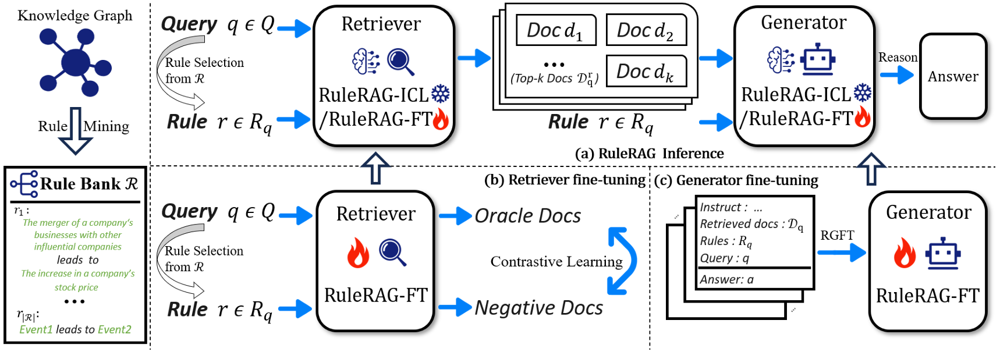
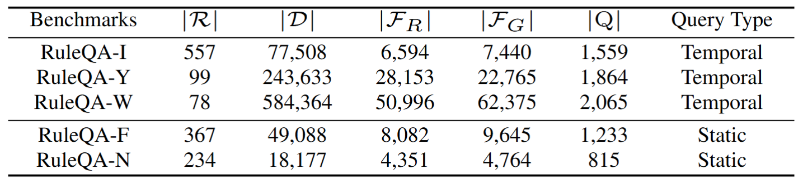

**RuleRAG: Rule Meets Retrieval-Augmented Generation for Question Answering**
====

****

This is the official implementation repository of the paper, RuleRAG: Rule Meets Retrieval-Augmented Generation for Question Answering.
 
****

The framework of our proposed RuleRAG, including RuleRAG-ICL and RuleRAG-FT. RuleRAG-ICL relies on in-context learning (ICL) with the guidance of rules. RuleRAG-FT involves fine-tuning retrievers and generators ahead.

 
****

The statistics of the five RuleQA benchmarks. 

 
****

Train the generators of RuleRAG: main_train.py

Inference of RuleRAG: RuleRAG_inference.py

