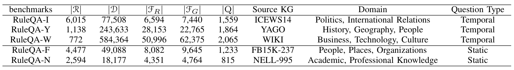

**RuleRAG: Rule-guided Retrieval-Augmented Generation with Language Models for Question Answering**
====

This is the official implementation repository of the paper, RuleRAG: Rule-guided retrieval-augmented generation with language models for question answering.
 
****

The framework of our proposed RuleRAG, including RuleRAG-ICL and RuleRAG-FT. RuleRAG-ICL relies on in-context learning (ICL) with the guidance of rules. RuleRAG-FT involves fine-tuning retrievers and generators ahead.

 
****

Our constructed five RuleQA benchmarks are stored on [Google Drive](https://drive.google.com/drive/folders/13tbJS-Eq3Cswck3JRPU0LJIZ1Vrz3Bga?usp=sharing).

The statistics of the five RuleQA benchmarks. 

 
****

Trian the retrievers of RuleRAG: We use the public implementation of the retrievers. The training data is stored on [Google Drive](https://drive.google.com/drive/folders/13tbJS-Eq3Cswck3JRPU0LJIZ1Vrz3Bga?usp=sharing)

Train the generators of RuleRAG: main_train.py

Inference of RuleRAG: RuleRAG_inference.py

****

My homepage : https://www.researchgate.net/profile/Zhongwu-Chen-2
